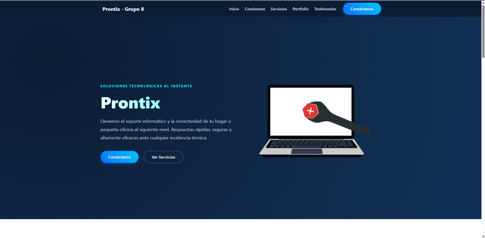
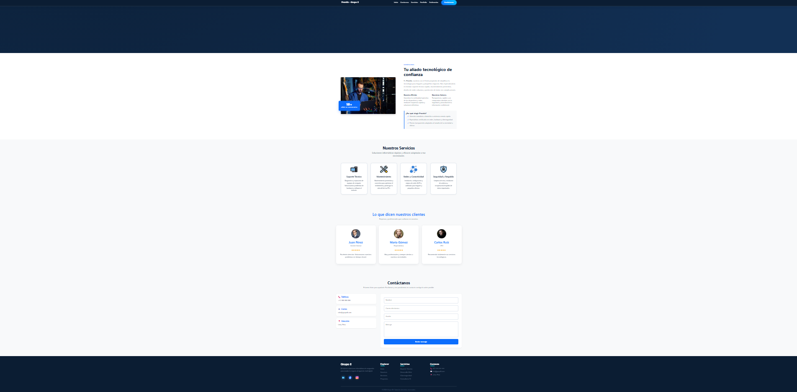
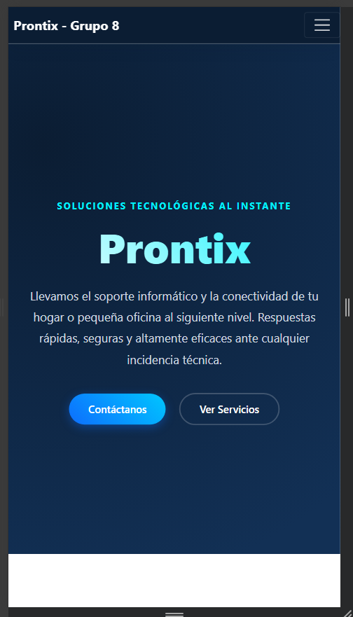
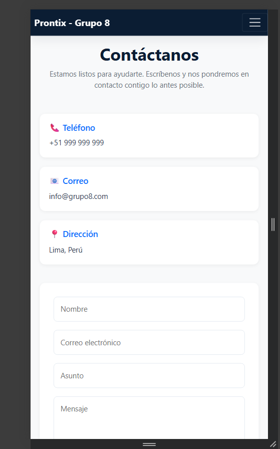

# Reporte - Landing Page Prontix

## Información general
- Equipo: Grupo 05
- Integrantes: 
- Fecha: 15/07/2026

## Descripción del proyecto
Se desarrolló un landing page en un entorno vanilla utilizando HTML, Bootstrap, CSS personalizado y preprocesador SCSS. La propuesta busca presentar una interfaz moderna, clara y responsiva para una empresa de servicios tecnológicos, destacando sus servicios, valores y opciones de contacto.

## Evidencia de interfaz
- Captura 1: landing page completa.


- Captura 2: vista responsiva.

- Captura 3: formulario o navbar en vista móvil.


## Tecnologías utilizadas
- Bootstrap: para la estructura y componentes responsivos.
- CSS: para personalizaciones visuales y estilos propios.
- SCSS: para organizar estilos mediante variables, nesting, mixins y modularización.
- Entorno vanilla: sin frameworks JavaScript adicionales, solo HTML, CSS y Bootstrap.

## Clases Bootstrap utilizadas y SCSS
- Grilla: col-md-6, col-lg-4, row, container.
- Componentes: navbar, card, badge, alert, button y form.
- Utilidades: py-5, mb-3, text-center, shadow-sm, rounded-4 y otras clases de espaciado.
- Formularios: form-control, mb-3, text-center, shadow-sm, rounded-4.
- Personalizaciones en estilos.css: variables de color, clases como .hero-destacado, .tarjeta-propia y estilos específicos para secciones.

## Implementación con SCSS
El proyecto incorpora SCSS para mejorar la mantenibilidad del código y evitar repetir estilos. Se emplearon:

- Variables para colores, tipografías, sombras, radios y espaciados.
- Anidación para estructurar componentes como el header, tarjetas y formularios.
- Mixins para reutilizar estilos en distintas secciones.
- Importación de partials para separar la lógica visual en archivos más claros y organizados.

Ejemplo de estructura utilizada:

```scss
@import "variables";

@mixin tm-card {
  background: $color-surface;
  border-radius: $radius-lg;
  box-shadow: $shadow-md;
}

.tm_card {
  @include tm-card;
  padding: 35px;
}
```

## Ventajas identificadas
- Rapidez de construcción: Sí
- Diseño responsivo: Sí
- Componentes reutilizables: Sí
- Consistencia visual: Sí
- Organización del código: Sí, gracias a SCSS

## Riesgos o limitaciones
- Apariencia genérica: Sí
- Dependencia del framework: Sí
- Sobreescritura excesiva: Sí
- Clases usadas sin criterio: No
- Curva de aprendizaje inicial para SCSS: Media

## Decisión técnica
¿Bootstrap conviene para esta landing? Sí

Motivo: No es necesario contener componentes complejos, solo se necesita una página estética, funcional y rápida de implementar.

Riesgo que se debe controlar: Que la página se vea genérica si se usan demasiadas clases base sin personalización.

Aplicación en una página web real: Sí

## Checklist final
- [✔️] index.html abre correctamente en el navegador.
- [✔️] Bootstrap CSS está vinculado antes de estilos.css.
- [✔️] Bootstrap Bundle JS está vinculado antes del cierre de body.
- [✔️] La página contiene navbar, hero, tarjetas, usos/aplicaciones y formulario.
- [✔️] Se usa container, row y columnas responsivas.
- [✔️] Se usan componentes: navbar, card, badge, alert, button y form.
- [✔️] Se usan utilidades: py-5, mb-3, text-center, shadow-sm, rounded-4 u otras.
- [✔️] estilos.css personaliza sin romper la base de Bootstrap.
- [✔️] La interfaz se revisó en vista amplia y vista móvil.
- [✔️] El reporte contiene capturas, ventajas, riesgos y decisión técnica.
